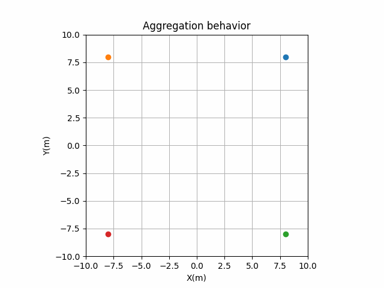
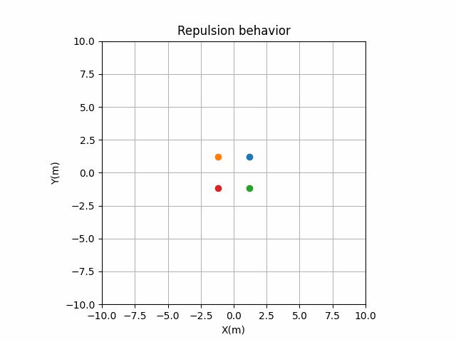

# pyswarming
[](https://github.com/mrsonandrade/pyswarming/actions/workflows/tests_package.yml)
[](https://www.repostatus.org/#active)
[](https://pyswarming.readthedocs.io/en/latest/?badge=latest)

[](https://pepy.tech/project/pyswarming)
[](https://doi.org/10.21105/joss.05647)


`pyswarming` is a research toolkit for Swarm Robotics.


## Installation
You can install ``pyswarming`` from PyPI using pip (**Recommended**):
```
pip install pyswarming
```

## Dependencies

`pyswarming`'s dependencies are: `numpy`, `numdifftools` and `matplotlib`.


## Documentation
The official documentation is hosted on **[ReadTheDocs](https://pyswarming.readthedocs.io)**.

## Algorithms covered
This library includes the following algorithms to be used in swarm robotics:

- **Leaderless heading consensus**: the collective performs heading consensus [^1];
- **Inverse power**: ajustable attraction and repulsion laws [^2];
- **Spring**: allows the robots to maintain a desired distance between them [^2];
- **Force law**: mimics the gravitational force [^3];
- **Repulsive force**: makes the individuals repulse each other [^4];
- **Body force**: introduces a body force that considers the radii of the robots [^4];
- **Inter robot spacing**: allows the robots to maintain a desired distance between them [^5];
- **Dissipative**: a dissipative force that reduces the "energy" of the robots [^5];
- **Leader following**: the collective performs heading consensus with a leader [^6];
- **Collision avoidance**: the robot stays away from neighbors in the vicinity [^7];
- **Attraction alignment**: the robot becomes attracted and aligned [^7];
- **Preferred direction**: the robot has a preference to move toward a preset direction [^7];
- **Lennard-Jones**: allows the formation of lattices [^8];
- **Virtual viscosity**: a viscous force that reduces the "oscillation" of the robots [^8];
- **Modified attraction alignment**: the robot becomes attracted and aligned by considering a “social importance” factor [^9];
- **Heading consensus**: the collective performs heading consensus [^10];
- **Perimeter defense**: the robots maximize the perimeter covered in an unknown environment [^10];
- **Environment exploration**: provides spatial coverage [^10];
- **Aggregation**: makes all the individuals aggregate collectively [^11];
- **Alignment**: the collective performs heading consensus [^11];
- **Geofencing**: attract the robots towards area A [^11];
- **Repulsion**: makes all the individuals repulse collectively [^11];
- **Target**: the robot goes to an specific target location [^11];
- **Area coverage**: using the Geofencing and Repulsion algorithms [^11];
- **Collective navigation**: using the Target and Repulsion algorithms [^11];
- **Flocking**: using the Aggregation, Repulsion and Alignment algorithms [^11];


[^1]: T. Vicsek, A. Czirók, E. Ben-Jacob, I. Cohen, and O. Shochet, “Novel Type of Phase Transition in a System of Self-Driven Particles,” Phys. Rev. Lett., vol. 75, no. 6, pp. 1226–1229, Aug. 1995. https://doi.org/10.1103/PhysRevLett.75.1226.

[^2]: J. H. Reif and H. Wang, “Social potential fields: A distributed behavioral control for autonomous robots,” Robot. Auton. Syst., vol. 27, no. 3, pp. 171–194, May 1999. https://doi.org/10.1016/S0921-8890(99)00004-4.

[^3]: W. M. Spears and D. F. Gordon, “Using artificial physics to control agents,” in Proceedings 1999 International Conference on Information Intelligence and Systems (Cat. No.PR00446), Bethesda, MD, USA: IEEE Comput. Soc, 1999, pp. 281–288. https://doi.org/10.1109/ICIIS.1999.810278.

[^4]: D. Helbing, I. Farkas, and T. Vicsek, “Simulating dynamical features of escape panic,” Nature, vol. 407, no. 6803, pp. 487–490, Sep. 2000. https://doi.org/10.1038/35035023.

[^5]: N. E. Leonard and E. Fiorelli, “Virtual leaders, artificial potentials and coordinated control of groups,” presented at the IEEE Conference on Decision and Control, 2001. https://doi.org/10.1109/CDC.2001.980728.

[^6]: A. Jadbabaie, Jie Lin, and A. S. Morse, “Coordination of groups of mobile autonomous agents using nearest neighbor rules,” IEEE Trans. Autom. Control, vol. 48, no. 6, pp. 988–1001, Jun. 2003. https://doi.org/10.1109/TAC.2003.812781.

[^7]: I. D. Couzin, J. Krause, N. R. Franks, and S. A. Levin, “Effective leadership and decision-making in animal groups on the move,” Nature, vol. 433, no. 7025, pp. 513–516, Feb. 2005. https://doi.org/10.1038/nature03236.

[^8]: C. Pinciroli et al., “Lattice Formation in Space for a Swarm of Pico Satellites,” in Ant Colony Optimization and Swarm Intelligence, M. Dorigo, M. Birattari, C. Blum, M. Clerc, T. Stützle, and A. F. T. Winfield, Eds., in Lecture Notes in Computer Science, vol. 5217. Berlin, Heidelberg: Springer Berlin Heidelberg, 2008, pp. 347–354. https://doi.org/10.1007/978-3-540-87527-7_36.

[^9]: R. Freeman and D. Biro, “Modelling Group Navigation: Dominance and Democracy in Homing Pigeons,” J. Navig., vol. 62, no. 1, pp. 33–40, Jan. 2009. https://doi.org/10.1017/S0373463308005080.

[^10]: M. Chamanbaz et al., “Swarm-Enabling Technology for Multi-Robot Systems,” Front. Robot. AI, vol. 4, Apr. 2017. https://doi.org/10.3389/frobt.2017.00012.

[^11]: B. M. Zoss et al., “Distributed system of autonomous buoys for scalable deployment and monitoring of large waterbodies,” Auton. Robots, vol. 42, no. 8, pp. 1669–1689, Dec. 2018. https://doi.org/10.1007/s10514-018-9702-0.

## Citing PySwarming

If you make use of PySwarming for your research, please cite our [JOSS publication](https://joss.theoj.org/papers/10.21105/joss.05647). Here is the corresponding BibTeX entry:

```
@article{deAndrade2023,
    doi = {10.21105/joss.05647},
    url = {https://doi.org/10.21105/joss.05647},
    year = {2023},
    publisher = {The Open Journal},
    volume = {8},
    number = {89},
    pages = {5647},
    author = {Emerson Martins de Andrade and Antonio Carlos Fernandes and Joel Sena Sales},
    title = {PySwarming: a research toolkit for Swarm Robotics},
    journal = {Journal of Open Source Software}
}
```

## Examples using pyswarming.swarm
```python
# importing the swarm creator
import pyswarming.swarm as ps
```

### Repulsion 
```python
# creating the swarm
my_swarm = ps.Swarm(n = 10, # number of robots
                    linear_speed = 0.5, # linear speed of each robot
                    dT = 1.0, # sampling time
                    deployment_point_limits = [[0.0, 0.0, 0.0], [5.0, 5.0, 0.0]], # lower and upper limits for the position deployment
                    deployment_orientation_limits = [[0.0, 0.0, 0.0], [0.0, 0.0, 2*3.1415]], # lower and upper limits for the orientation deployment
                    distribution_type =  'uniform', # type of distribution used to deploy the robots
                    plot_limits = [[-50.0, 50.0], [-50.0, 50.0]], # plot limits x_lim, y_lim
                    behaviors = ['repulsion']) # list of behaviors
my_swarm.simulate()
```

### Collective navigation 
```python
# creating the swarm
my_swarm = ps.Swarm(n = 10, # number of robots
                    linear_speed = 0.5, # linear speed of each robot
                    dT = 1.0, # sampling time
                    deployment_point_limits = [[0.0, 0.0, 0.0], [5.0, 5.0, 0.0]], # lower and upper limits for the position deployment
                    deployment_orientation_limits = [[0.0, 0.0, 0.0], [0.0, 0.0, 2*3.1415]], # lower and upper limits for the orientation deployment
                    distribution_type =  'uniform', # type of distribution used to deploy the robots
                    plot_limits = [[-50.0, 50.0], [-50.0, 50.0]], # plot limits x_lim, y_lim
                    behaviors = ['collective_navigation']) # list of behaviors
my_swarm.behaviors_dict['r_out']['collective_navigation']['alpha'] = 2.0  # setting the strength of the repulsion
my_swarm.behaviors_dict['r_out']['collective_navigation']['T'] = [-40, -40, 0] # setting the target
my_swarm.simulate()
```

### Target + Aggregation
```python
# creating the swarm
my_swarm = ps.Swarm(n = 10, # number of robots
                    linear_speed = 0.5, # linear speed of each robot
                    dT = 1.0, # sampling time
                    deployment_point_limits = [[0.0, 0.0, 0.0], [5.0, 5.0, 0.0]], # lower and upper limits for the position deployment
                    deployment_orientation_limits = [[0.0, 0.0, 0.0], [0.0, 0.0, 2*3.1415]], # lower and upper limits for the orientation deployment
                    distribution_type =  'uniform', # type of distribution used to deploy the robots
                    plot_limits = [[-50.0, 50.0], [-50.0, 50.0]], # plot limits x_lim, y_lim
                    behaviors = ['target','aggregation']) # list of behaviors
my_swarm.behaviors_dict['r_out']['target']['T'] = [-40, -40, 0] # setting the target
my_swarm.simulate()
```

## Other Examples
Considering a swarm of robots, they can show different behaviors by using ``pyswarming``. The following codes are simplified implementations, for detailed ones, see the [examples](https://github.com/mrsonandrade/pyswarming/tree/main/examples) folder.
```python
# importing the swarming behaviors
import pyswarming.behaviors as pb

# importing numpy to work with arrays
import numpy as np
```


### Target
To simplify, considering just one robot.
```python
# define the robot (x, y, z) position
robot_position_i = np.asarray([0., 0., 0.])

# set the robot speed
robot_speed_i = 1.0

# define a target (x, y, z) position
target_position = np.asarray([8., 8., 0.])

for t in range(15):

    # print the robot (x, y, z) position
    print(robot_position_i)

    # update the robot (x, y, z) position
    robot_position_i += robot_speed_i*pb.target(robot_position_i, target_position)
```


### Aggregation 
Considering four robots.
```python
# define each robot (x, y, z) position
robot_position = np.asarray([[8., 8., 0.],
                            [-8., 8., 0.],
                            [8., -8., 0.],
                            [-8., -8., 0.]])

# set the robot speed
robot_speed = 1.0

for time_i in range(15):

    # print the robot (x, y, z) positions
    print(robot_speed)

    # update the robot (x, y, z) positions
    for r_ind in range(len(robot_speed)):
        r_i = robot_speed[r_ind]
        r_j = np.delete(robot_speed, np.array([r_ind]), axis=0)
        robot_speed[r_ind] += robot_speed*pb.aggregation(r_i, r_j)
```



### Repulsion 
Considering four robots.
```python
# define each robot (x, y, z) position
robot_position = np.asarray([[1., 1., 0.],
                            [-1., 1., 0.],
                            [1., -1., 0.],
                            [-1., -1., 0.]])

# set the robot speed
robot_speed = 1.0

for time_i in range(15):

    # print the robot (x, y, z) positions
    print(robot_position)

    # update the robot (x, y, z) positions
    for r_ind in range(len(robot_position)):
        r_i = robot_position[r_ind]
        r_j = np.delete(robot_position, np.array([r_ind]), axis=0)
        robot_position[r_ind] += robot_speed*pb.repulsion(r_i, r_j, 3.0)
```


### Aggregation + Repulsion 
Considering four robots.
```python
# define each robot (x, y, z) position
robot_position = np.asarray([[8., 8., 0.],
                            [-8., 8., 0.],
                            [8., -8., 0.],
                            [-8., -8., 0.]])

# set the robot speed
robot_speed = 1.0

for time_i in range(15):

    # print the robot (x, y, z) positions
    print(robot_position)

    # update the robot (x, y, z) positions
    for r_ind in range(len(robot_position)):
        r_i = robot_position[r_ind]
        r_j = np.delete(robot_position, np.array([r_ind]), axis=0)
        robot_position[r_ind] += s_i*(pb.aggregation(r_i, r_j) + pb.repulsion(r_i, r_j, 5.0))
```


## Contributing to pyswarming
All kind of contributions are welcome: 
* Improvement of code with new features, bug fixes, and  bug reports
* Improvement of documentation
* Additional tests

Follow the instructions [here](https://pyswarming.readthedocs.io/en/latest/Contribution.html)
for submitting a PR (Pull Request).

If you have any ideas or questions, feel free to open an issue.

## Acknowledgements
The authors would like to thank the Human Resources Program from the National Agency of Oil, Gas and Bio Combustibles – PRH-ANP for the financial support.
This work was supported by "Coordenação de Aperfeiçoamento de Pessoal de Nível Superior - Brasil (CAPES)", [LOC/COPPE/UFRJ](https://www.loc.ufrj.br/index.php/en/) ([Laboratory of Waves and Current](https://www.loc.ufrj.br/index.php/en/) - [Federal University of Rio de Janeiro](https://ufrj.br/en/)) and the National Council for Scientific and Technological Development (CNPq), which are gratefully acknowledged.
