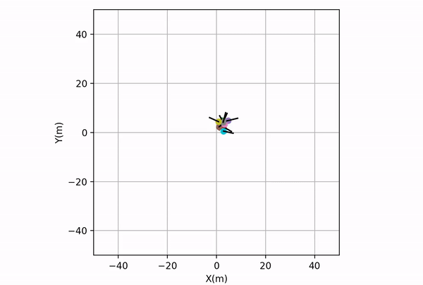

.. pyswarming documentation master file.
   You can adapt this file completely to your liking, but it should at least
   contain the root `toctree` directive.

Welcome to pyswarming's documentation!
++++++++++++++++++++++++++++++++++++

.. image:: ../readme_pics/logo.png
   :alt: pyswarming
   :align: left

Introduction
============

``pyswarming`` is a research toolkit for Swarm Robotics.

https://github.com/mrsonandrade/pyswarming

Install
=======
You can install ``pyswarming`` from PyPI using pip (**Recommended**)::

   pip install pyswarming

Dependencies
============

``pyswarming``'s dependencies are: ``numpy``, ``numdifftools`` and ``matplotlib``.

Algorithms covered
==================
This library includes the following algorithms to be used in swarm robotics:

* **Leaderless heading consensus**: the collective performs heading consensus [1]_;
* **Inverse power**: ajustable attraction and repulsion laws [2]_;
* **Spring**: allows the robots to maintain a desired distance between them [2]_;
* **Force law**: mimics the gravitational force [3]_;
* **Repulsive force**: makes the individuals repulse each other [4]_;
* **Body force**: introduces a body force that considers the radii of the robots [4]_;
* **Inter robot spacing**: allows the robots to maintain a desired distance between them [5]_;
* **Dissipative**: a dissipative force that reduces the "energy" of the robots [5]_;
* **Leader following**: the collective performs heading consensus with a leader [6]_;
* **Collision avoidance**: the robot stays away from neighbors in the vicinity [7]_;
* **Attraction alignment**: the robot becomes attracted and aligned [7]_;
* **Preferred direction**: the robot has a preference to move toward a preset direction [7]_;
* **Lennard-Jones**: allows the formation of lattices [8]_;
* **Virtual viscosity**: a viscous force that reduces the "oscillation" of the robots [8]_;
* **Modified attraction alignment**: the robot becomes attracted and aligned by considering a “social importance” factor [9]_;
* **Heading consensus**: the collective performs heading consensus [10]_;
* **Perimeter defense**: the robots maximize the perimeter covered in an unknown environment [10]_;
* **Environment exploration**: provides spatial coverage [10]_;
* **Aggregation**: makes all the individuals aggregate collectively [11]_;
* **Alignment**: the collective performs heading consensus [11]_;
* **Geofencing**: attract the robots towards area A [11]_;
* **Repulsion**: makes all the individuals repulse collectively [11]_;
* **Target**: the robot goes to an specific target location [11]_;
* **Area coverage**: using the Geofencing and Repulsion algorithms [11]_;
* **Collective navigation**: using the Target and Repulsion algorithms [11]_;
* **Flocking**: using the Aggregation, Repulsion and Alignment algorithms [11]_;

References
==========

.. [1] T. Vicsek, A. Czirók, E. Ben-Jacob, I. Cohen, and O. Shochet, “Novel Type of Phase Transition in a System of Self-Driven Particles,” Phys. Rev. Lett., vol. 75, no. 6, pp. 1226–1229, Aug. 1995. https://doi.org/10.1103/PhysRevLett.75.1226.

.. [2] J. H. Reif and H. Wang, “Social potential fields: A distributed behavioral control for autonomous robots,” Robot. Auton. Syst., vol. 27, no. 3, pp. 171–194, May 1999. https://doi.org/10.1016/S0921-8890(99)00004-4.

.. [3] W. M. Spears and D. F. Gordon, “Using artificial physics to control agents,” in Proceedings 1999 International Conference on Information Intelligence and Systems (Cat. No.PR00446), Bethesda, MD, USA: IEEE Comput. Soc, 1999, pp. 281–288. https://doi.org/10.1109/ICIIS.1999.810278.

.. [4] D. Helbing, I. Farkas, and T. Vicsek, “Simulating dynamical features of escape panic,” Nature, vol. 407, no. 6803, pp. 487–490, Sep. 2000. https://doi.org/10.1038/35035023.

.. [5] N. E. Leonard and E. Fiorelli, “Virtual leaders, artificial potentials and coordinated control of groups,” presented at the IEEE Conference on Decision and Control, 2001. https://doi.org/10.1109/CDC.2001.980728.

.. [6] A. Jadbabaie, Jie Lin, and A. S. Morse, “Coordination of groups of mobile autonomous agents using nearest neighbor rules,” IEEE Trans. Autom. Control, vol. 48, no. 6, pp. 988–1001, Jun. 2003. https://doi.org/10.1109/TAC.2003.812781.

.. [7] I. D. Couzin, J. Krause, N. R. Franks, and S. A. Levin, “Effective leadership and decision-making in animal groups on the move,” Nature, vol. 433, no. 7025, pp. 513–516, Feb. 2005. https://doi.org/10.1038/nature03236.

.. [8] C. Pinciroli et al., “Lattice Formation in Space for a Swarm of Pico Satellites,” in Ant Colony Optimization and Swarm Intelligence, M. Dorigo, M. Birattari, C. Blum, M. Clerc, T. Stützle, and A. F. T. Winfield, Eds., in Lecture Notes in Computer Science, vol. 5217. Berlin, Heidelberg: Springer Berlin Heidelberg, 2008, pp. 347–354. https://doi.org/10.1007/978-3-540-87527-7_36.

.. [9] R. Freeman and D. Biro, “Modelling Group Navigation: Dominance and Democracy in Homing Pigeons,” J. Navig., vol. 62, no. 1, pp. 33–40, Jan. 2009. https://doi.org/10.1017/S0373463308005080.

.. [10] M. Chamanbaz et al., “Swarm-Enabling Technology for Multi-Robot Systems,” Front. Robot. AI, vol. 4, Apr. 2017. https://doi.org/10.3389/frobt.2017.00012.

.. [11] B. M. Zoss et al., “Distributed system of autonomous buoys for scalable deployment and monitoring of large waterbodies,” Auton. Robots, vol. 42, no. 8, pp. 1669–1689, Dec. 2018. https://doi.org/10.1007/s10514-018-9702-0.

Examples using ``pyswarming.swarm``
==================================
   
Repulsion (low-code)
-------------------
For this example we will use a low-code approach, i.e., ``pyswarming.swarm``, for details, see the `examples <https://github.com/mrsonandrade/pyswarming/tree/main/examples>`_ or the `notebooks <https://github.com/mrsonandrade/pyswarming/tree/main/notebooks>`_ folder.
:: 
   # importing the swarm creator
   import pyswarming.swarm as ps

   # creating the swarm
   my_swarm = ps.Swarm(n = 10, # number of robots
                       linear_speed = 0.5, # linear speed of each robot
                       dT = 1.0, # sampling time
                       deployment_point_limits = [[0.0, 0.0, 0.0], [5.0, 5.0, 0.0]], # lower and upper limits for the position deployment
                       deployment_orientation_limits = [[0.0, 0.0, 0.0], [0.0, 0.0, 2*3.1415]], # lower and upper limits for the orientation deployment
                       distribution_type =  'uniform', # type of distribution used to deploy the robots
                       plot_limits = [[-50.0, 50.0], [-50.0, 50.0]], # plot limits x_lim, y_lim
                       behaviors = ['repulsion']) # list of behaviors
   my_swarm.simulate()

Respulsion (without low-code)
----------------------------
Considering a swarm of robots, they can show different behaviors by using ``pyswarming``, for details, see the `examples <https://github.com/mrsonandrade/pyswarming/tree/main/examples>`_ or the `notebooks <https://github.com/mrsonandrade/pyswarming/tree/main/notebooks>`_ folder.
::
   # importing pyswarming behaviors
   import pyswarming.behaviors as pb

   # importing numpy to work with arrays
   import numpy as np

   # importing matplotlib to plot the animation
   import matplotlib.pyplot as plt
   import matplotlib.animation as animation

   # importing functools.partial to use in the animation
   from functools import partial

   # define each robot (x, y, z) position
   robot_poses = np.asarray([[1., 1., 0.],
                           [-1., 1., 0.],
                           [1., -1., 0.],
                           [-1., -1., 0.]])

   # set the robot linear velocity
   robot_speed = 0.025

   # First set up the figure, the axis, and the plot element we want to animate
   fig, ax = plt.subplots()

   ax.set_xlim([-10,10])
   ax.set_ylim([-10,10])
   ax.set_xlabel('X(m)')
   ax.set_ylabel('Y(m)')
   ax.grid()
   ax.set_aspect('equal')
   ax.set_title('Repulsion behavior')

   robot1, = ax.plot([], [], marker='o', lw=0)
   robot2, = ax.plot([], [], marker='o', lw=0)
   robot3, = ax.plot([], [], marker='o', lw=0)
   robot4, = ax.plot([], [], marker='o', lw=0)

   # initialization function: plot the background of each frame
   def init():
      robot1.set_data([], [])
      robot2.set_data([], [])
      robot3.set_data([], [])
      robot4.set_data([], [])
      return (robot1,robot2,robot3,robot4,)

   # animation function. This is called sequentially
   def animate(i, robot_poses):
      for r_ind in range(len(robot_poses)):
         r_i = robot_poses[r_ind]
         r_j = np.delete(robot_poses, np.array([r_ind]), axis=0)
         robot_poses[r_ind] += robot_speed*pb.repulsion(r_i, r_j, 5.0)
      robot1.set_data(robot_poses[0][0], robot_poses[0][1])
      robot2.set_data(robot_poses[1][0], robot_poses[1][1])
      robot3.set_data(robot_poses[2][0], robot_poses[2][1])
      robot4.set_data(robot_poses[3][0], robot_poses[3][1])
      return (robot1,robot2,robot3,robot4,)

   # call the animator. blit=True means only re-draw the parts that 
   # have changed.
   anim = animation.FuncAnimation(fig, partial(animate, robot_poses=robot_poses), init_func=init,
                                 frames=480, interval=1, blit=True)

   anim
   plt.show()

.. image:: ../readme_pics/Repulsion.gif

.. toctree::
   :maxdepth: 1
   :hidden:
   :caption: Contents:

   Introduction <self>
   Examples
   API Reference <pyswarming>
   All Functions <functions>
   Contribution
   Acknowledgements

