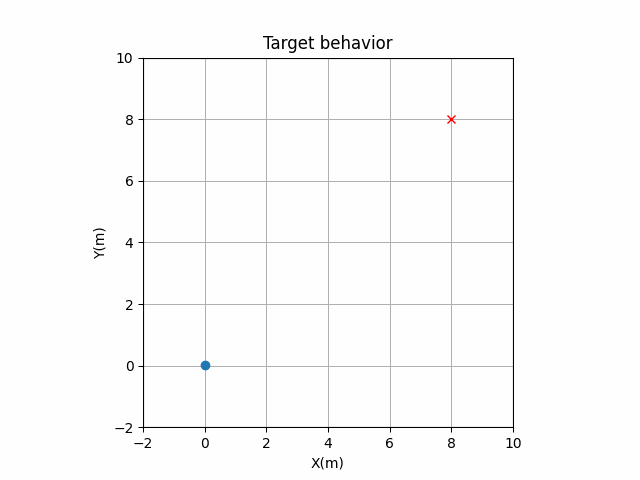

.. pyswarming documentation master file.
   You can adapt this file completely to your liking, but it should at least
   contain the root `toctree` directive.

Welcome to pyswarming's documentation!
++++++++++++++++++++++++++++++++++++

.. image:: ../readme_pics/logo.png
   :alt: pyswarming
   :align: left

Introduction
============

``pyswarming`` is a research toolkit for Swarm Robotics.

The package is currently maintained by `@mrsonandrade <http://github.com/mrsonandrade>`_.

https://github.com/mrsonandrade/pyswarming

Install
=======
You can install ``pyswarming`` from PyPI using pip (**Recommended**)::

   pip install pyswarming

Dependencies
============

``pyswarming``'s dependencies are: ``numpy``.

Algorithms covered
==================
This library includes the following algorithms to be used in swarm robotics:

* **Leaderless Coordination**: the collective performs heading consensus [1]_;
* **Leader Following**: the collective performs heading consensus with a leader [2]_;
* **Collision Avoidance**: the robot stay away from neighbors in the vicinity [3]_;
* **Attraction and Alignment**: the robot become attracted and aligned [3]_;
* **Preferred Direction**: the robot has preference to move toward a preset direction [3]_;
* **Modified Attraction and Alignment**: the robot become attracted and aligned by considering a “social importance” factor [4]_;
* **Heading Consensus**: the collective performs heading consensus [5]_;
* **Perimeter Defense**: the robots maximize the perimeter covered in a an unknown environment [5]_;
* **Environment Exploration**: the robots provide a spatial coverage [5]_;
* **Aggregation**: makes all the individuals aggregate collectively [6]_;
* **Alignment**: the collective performs heading consensus [6]_;
* **Geofencing**: attract the robots towards the area A [6]_;
* **Repulsion**: makes all the individuals repulse collectively [6]_;
* **Target**: the robot goes to an specific target location [6]_;

.. rubric:: References

.. [1] Vicsek T, Czirók A, Ben-Jacob E, Cohen I, Shochet O. Novel Type of Phase Transition in a System of Self-Driven Particles. Phys Rev Lett 1995;75:1226–9. https://doi.org/10.1103/PhysRevLett.75.1226.

.. [2] Jadbabaie A, Jie Lin, Morse AS. Coordination of groups of mobile autonomous agents using nearest neighbor rules. IEEE Trans Automat Contr 2003;48:988–1001. https://doi.org/10.1109/TAC.2003.812781.

.. [3] Couzin ID, Krause J, Franks NR, Levin SA. Effective leadership and decision-making in animal groups on the move. Nature 2005;433:513–6. https://doi.org/10.1038/nature03236.

.. [4] Freeman R, Biro D. Modelling Group Navigation: Dominance and Democracy in Homing Pigeons. J Navigation 2009;62:33–40. https://doi.org/10.1017/S0373463308005080.

.. [5] Chamanbaz M, Mateo D, Zoss BM, Tokić G, Wilhelm E, Bouffanais R, et al. Swarm-Enabling Technology for Multi-Robot Systems. Front Robot AI 2017;4. https://doi.org/10.3389/frobt.2017.00012.

.. [6] Zoss BM, Mateo D, Kuan YK, Tokić G, Chamanbaz M, Goh L, et al. Distributed system of autonomous buoys for scalable deployment and monitoring of large waterbodies. Auton Robot 2018;42:1669–89. https://doi.org/10.1007/s10514-018-9702-0.

Examples
========
Considering a swarm of robots, they can show different behaviors by using ``pyswarming``. The following codes are simplified implementations, for detailed ones, see the `Examples <https://github.com/mrsonandrade/pyswarming/tree/main/Examples>`_ folder.::

   import pyswarming.behaviors as ps
   import numpy as np

Target
------
::

   # define the robot (x, y, z) position
   r_i = np.asarray([0., 0., 0.])

   # set the robot linear velocity
   s_i = 1.0

   # define a target (x, y, z) position
   T = np.asarray([8., 8., 0.])

   for t in range(15):

      # print the robot (x, y, z) position
      print(r_i)

      # update the robot (x, y, z) position
      r_i += s_i*ps.target(r_i, T)

Aggregation
-----------
::

   # define each robot (x, y, z) position
   r = np.asarray([[8., 8., 0.],
                  [-8., 8., 0.],
                  [8., -8., 0.],
                  [-8., -8., 0.]])

   # set the robot linear velocity
   s_i = 1.0

   for t in range(15):

      # print the robot (x, y, z) positions
      print(r)

      # update the robot (x, y, z) positions
      for r_ind in range(len(r)):
         r_i = r[r_ind]
         r_j = np.delete(r, np.array([r_ind]), axis=0)
         r[r_ind] += s_i*ps.aggregation(r_i, r_j)

.. image:: ../readme_pics/Aggregation.gif

Repulsion
---------
::

   # define each robot (x, y, z) position
   r = np.asarray([[1., 1., 0.],
                  [-1., 1., 0.],
                  [1., -1., 0.],
                  [-1., -1., 0.]])

   # set the robot linear velocity
   s_i = 1.0

   for t in range(15):

      # print the robot (x, y, z) positions
      print(r)

      # update the robot (x, y, z) positions
      for r_ind in range(len(r)):
         r_i = r[r_ind]
         r_j = np.delete(r, np.array([r_ind]), axis=0)
         r[r_ind] += s_i*ps.repulsion(r_i, r_j, 3.0)

.. image:: ../readme_pics/Repulsion.gif

Aggregation + Repulsion
-----------------------
::

   # define each robot (x, y, z) position
   r = np.asarray([[8., 8., 0.],
                  [-8., 8., 0.],
                  [8., -8., 0.],
                  [-8., -8., 0.]])

   # set the robot linear velocity
   s_i = 1.0

   for t in range(15):

      # print the robot (x, y, z) positions
      print(r)

      # update the robot (x, y, z) positions
      for r_ind in range(len(r)):
         r_i = r[r_ind]
         r_j = np.delete(r, np.array([r_ind]), axis=0)
         r[r_ind] += s_i*(ps.aggregation(r_i, r_j) + ps.repulsion(r_i, r_j, 5.0))

.. image:: ../readme_pics/AggregationRepulsion.gif

.. toctree::
   :maxdepth: 1
   :hidden:
   :caption: Contents:

   Introduction <self>
   Examples
   API Reference <pyswarming>
   All Functions <functions>
   Contribution
   Acknowledgements

