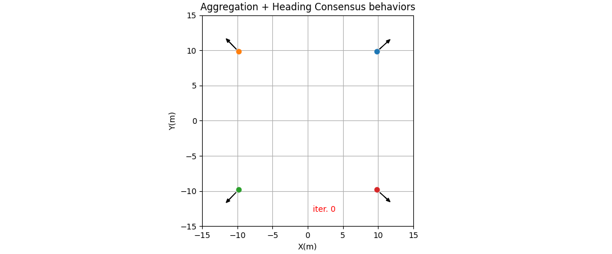
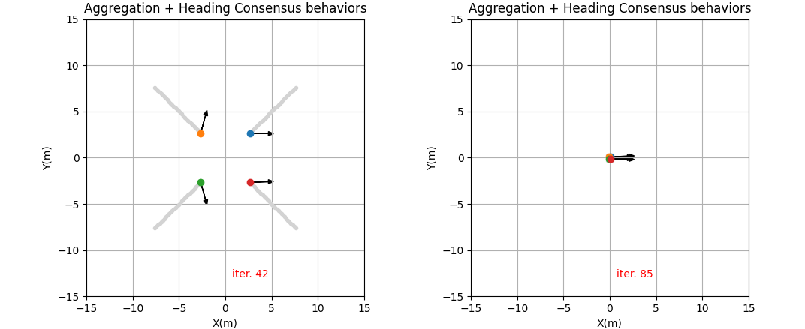

# Summary

Changes experienced in the field of swarm robotics over the past decade are unprecedented, with various demonstrations of the potential of this technology [@dorigo:2021]. It is important to notice that Swarm Robotics is a subfield of Multi-Robot Systems, which itself is also a subfield of Mobile Robotics research [@dias:2021].
These swarm robotic systems can be inspired or not by social insects or other animal societies [@trianni:2008], where basic behaviors are usually used to compose complex tasks. PySwarming contains implementations of different algorithms and authors, for instance, Leaderless Coordination [@vicsek:1995], Preferred Direction [@couzin:2005], Aggregation [@zoss:2018], and so on. Also, these algorithms are based on different design methos [@brambilla:2013], for example, a behavior-based design like a basic attraction-repulsion algorithm (for details see [@spears:2004]) can drive the robotic swarming by means of virtual forces, where the achieved configuration relies on minimizing the system’s potential energy.
More explanations regarding the algorithms and their use are in the API and PySwarming documentation. Also, an example usage (aggregation + heading consensus) is described below.

# Statement of Need

As stated by [@nedjah:2019], a significant issue in the swarm robotics field is the lack of common generic hardware platforms and controller design methodologies. Also, the authors claim an urgent need for standardization of software, to allow a possible flourishing of swarm robotics applicability to real-world applications.
Then, considering the challenge to organize the various methods developed in the swarm robotics field, PySwarming comes as a focal point, being flexible (written in Python) and customizable (can be easily adapted by the user), increasing the interaction of the researcher community and the advance of science.

# Algorithms covered

This library includes the following algorithms to be used in swarm robotics:

* **Leaderless Coordination**: the collective performs heading consensus [@vicsek:1995];
* **Leader Following**: the collective performs heading consensus with a leader [@jadbabaie:2003];
* **Collision Avoidance**: the robot stays away from neighbors in the vicinity [@couzin:2005];
* **Attraction and Alignment**: the robot becomes attracted and aligned [@couzin:2005];
* **Preferred Direction**: the robot has a preference to move toward a preset direction [@couzin:2005];
* **Modified Attraction and Alignment**: the robot becomes attracted and aligned by considering a “social importance” factor [@freeman:2009];
* **Heading Consensus**: the collective performs heading consensus [@chamanbaz:2017];
* **Perimeter Defense**: the robots maximize the perimeter covered in an unknown environment [@chamanbaz:2017];
* **Aggregation**: makes all the individuals aggregate collectively [@zoss:2018];
* **Alignment**: the collective performs heading consensus [@zoss:2018];
* **Geofencing**: attract the robots towards area A [@zoss:2018];
* **Repulsion**: makes all the individuals repulse collectively [@zoss:2018];
* **Target**: the robot goes to an specific target location [@zoss:2018];
 

# Example Usage 
To start our example, we will define a set of four robots assuming we have access to their positions and orientations. Initially, they are positioned far from each other, and also they have different orientations, as can be observed in \autoref{fig1}.

Then, using `PySwarming` we iterate over time by summing two different behaviors: (1) Aggregation and (2) Heading Consensus. Each of these behaviors is applied to each robot at each timestep. As expected, the robots will aggregate and adjust their headings simultaneously over the simulation. The mid and final results are shown in \autoref{fig2}.

The above simulation can be done by using other `PySwarming` behaviors, such as Attraction and Alignment, with just a few lines of code, which demonstrates the simplicity of `PySwarming`.

# Related Software Packages

Buzz is a programming language for heterogeneous robot swarms [@pinciroli:2015]. It offers primitives to define swarm behaviors and also single-robot instructions. PySwarm differs from Buzz mainly by the fact that it focuses on swarm behaviors and it is written in Python, which has a thriving ecosystem of third-party libraries. 

[@testa:2021] published ChoiRbot, a toolbox for distributed cooperative robotics based on the Robot Operating System (ROS) 2. Similarly, ROS2SWARM is a package for applications of swarm robotics that provides a library of ready-to-use swarm behavioral primitives [@kaiser:2022]. However, both implementations (ChoiRbot and ROS2SWARM) require ROS 2 to run, which makes PySwarm more suitable to obtain swarm behaviors through different platforms other than ROS.

Finally, a PySwarming characteristic is to maintain the implementations easy to read, keeping the syntax simple and closer to their sources. For example, the target algorithm by [@zoss:2018] is easily comparable with the mathematical formula of their article.

 

# Acknowledgements

This research is supported by CAPES (Coordination of Improvement of Higher Education Personnel), [LOC/COPPE/UFRJ](https://www.loc.ufrj.br/index.php/en/) ([Laboratory of Waves and Current](https://www.loc.ufrj.br/index.php/en/) - [Federal University of Rio de Janeiro](https://ufrj.br/en/)) and CNPq (Brazilian National Council for Scientific and Technological Development), which are gratefully acknowledged.

# References

